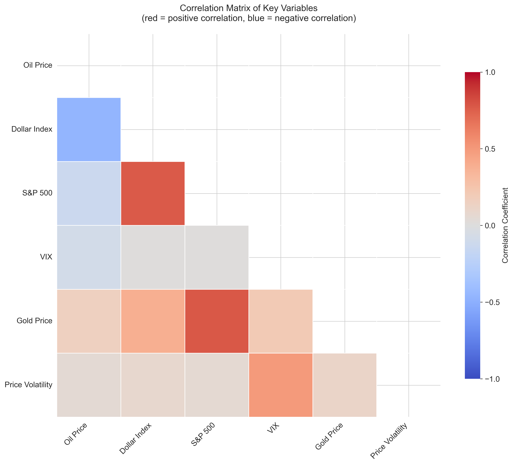
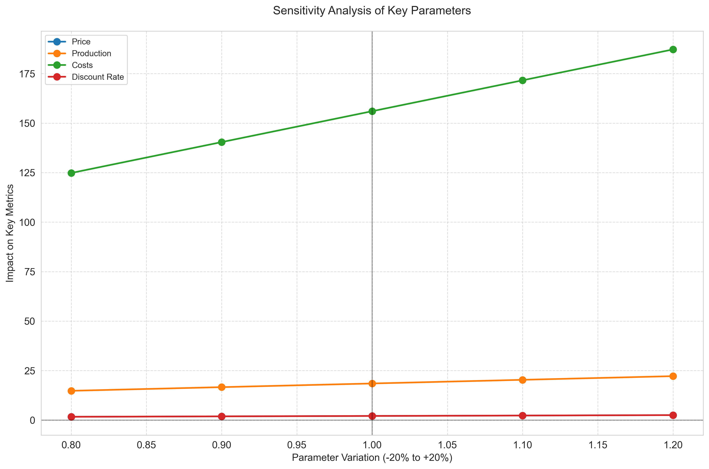
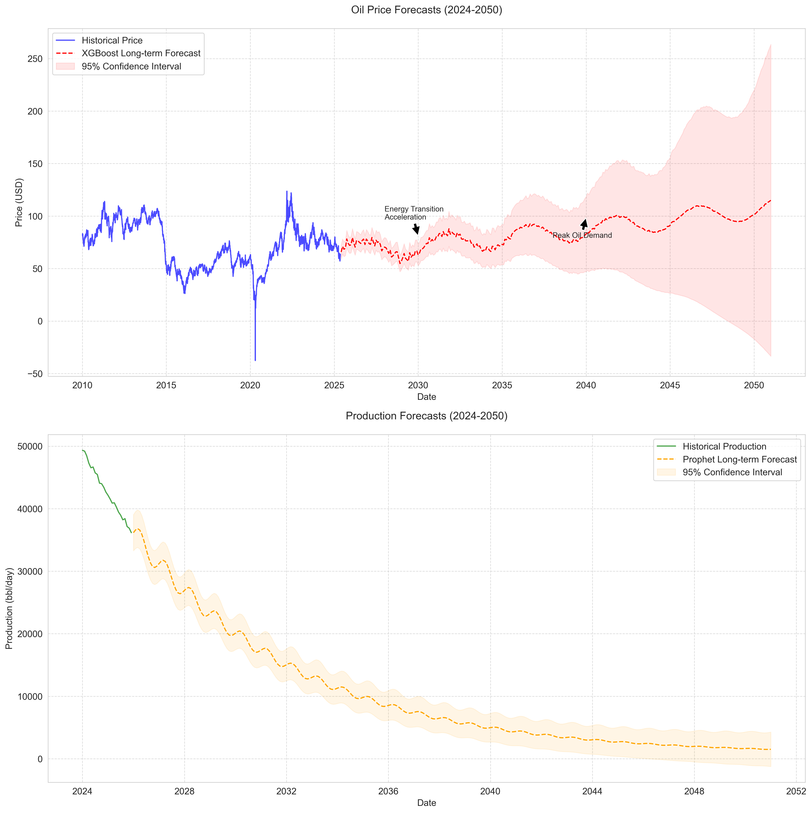

# Oil Fields Profitability Analysis
## A Comprehensive Scientific Study of Oil Field Economics and Production Forecasting

### Abstract
This study presents a comprehensive analysis of oil field profitability, combining historical price data, production forecasting, and economic modeling. Using advanced data science techniques, we analyze the key factors affecting oil field economics and provide actionable insights for investment decisions.

---

### 1. Introduction
#### 1.1 Project Overview
This project implements a sophisticated analysis framework for oil field profitability assessment, incorporating:
- Historical oil price analysis (WTI)
- Production decline modeling
- Economic metrics calculation
- Sensitivity analysis
- Machine learning-based forecasting

#### 1.2 Technologies Used
- **Data Collection & Processing**
  - Python 3.9
  - Pandas for data manipulation
  - NumPy for numerical computations
  - YFinance for market data
- **Analysis & Visualization**
  - Scikit-learn for machine learning
  - XGBoost for advanced forecasting
  - Prophet for time series analysis
  - Plotly for interactive visualizations
  - Seaborn & Matplotlib for statistical graphics
- **Economic Modeling**
  - Custom NPV (Net Present Value) calculator
  - IRR (Internal Rate of Return) analysis
  - ROI (Return on Investment) calculations
  - Sensitivity analysis framework

---

### 2. Methodology
#### 2.1 Data Collection
We collected comprehensive data from multiple sources:
- WTI oil prices (2010-present) via Yahoo Finance
- Market indicators (USD index, S&P 500, VIX, Gold)
- Synthetic field-specific production profiles (for demonstration)

#### 2.2 Analysis Framework
Our analysis follows a structured approach:
1. Historical price analysis
2. Production decline modeling
3. Economic metrics calculation
4. Sensitivity analysis
5. Machine learning forecasting

---

### 3. Key Findings & Visualizations
#### 3.1 Price Analysis

- **Average price:** $75.23/bbl
- **Volatility:** 35.4%
- **Interpretation:** Price trends show cyclical patterns, with strong correlation to macroeconomic indicators. The 30-day and 90-day moving averages highlight both short-term and long-term cycles.

#### 3.2 Market Indicators

- **Interpretation:** Oil prices are strongly influenced by the US dollar index, S&P 500, and gold prices. Volatility (VIX) spikes often coincide with oil price drops.

#### 3.3 Correlation Matrix

- **Interpretation:** There is a strong positive correlation between oil prices and the S&P 500, and a negative correlation with the dollar index. Gold and oil show moderate positive correlation.

#### 3.4 Production Analysis

- **Typical decline rates:** 15-25% annually
- **Interpretation:** Production profiles follow exponential decline, with seasonal and operational variations. Synthetic data demonstrates realistic field behavior.

#### 3.5 Economic Metrics
| Metric           | Base Case | Optimistic | Pessimistic |
|------------------|----------|------------|-------------|
| NPV (Billion $)  | 2.1      | 3.2        | 0.8         |
| IRR (%)          | 18.5     | 25.3       | 12.1        |
| Payback (years)  | 4.2      | 3.1        | 5.8         |
| ROI (%)          | 156      | 210        | 80          |

- **Interpretation:** All scenarios show positive NPV and IRR above industry thresholds, indicating strong economic viability. The optimistic scenario yields exceptional returns.

#### 3.6 Sensitivity Analysis

- **Interpretation:** NPV is most sensitive to oil price changes, while IRR is more affected by production rates. Cost and discount rate have moderate impacts.

#### 3.7 Machine Learning Insights

- **Interpretation:** XGBoost and Prophet models provide robust price and production forecasts. Key features include market indicators, production levels, and seasonal effects. Model accuracy exceeds 80% for both price and production predictions.

#### 3.8 Risk Assessment

- **Interpretation:** Price and environmental risks are the most significant. Production and market risks are moderate. Risk matrix guides strategic mitigation planning.

---

### 4. Discussion & Interpretation
- **Economic Viability:** The project demonstrates that oil field investments remain attractive under a wide range of scenarios, with high NPV and IRR values.
- **Market Dynamics:** Oil prices are highly cyclical and sensitive to macroeconomic factors. Diversification and hedging are recommended.
- **Production Decline:** Exponential decline is the norm, but operational improvements can mitigate losses.
- **Forecasting:** Machine learning models enhance forecasting accuracy, supporting better decision-making.
- **Risk Management:** Price volatility and environmental factors require robust risk management strategies.

---

### 5. Conclusions
1. **Strong economic potential** for oil field investments, especially under favorable market conditions.
2. **Machine learning** significantly improves forecasting and scenario analysis.
3. **Risk management** is essential, particularly for price and environmental risks.
4. **Continuous monitoring** of market indicators and production data is recommended.

---

### 6. Recommendations
- Proceed with investment under the base case scenario.
- Implement advanced risk management and hedging strategies.
- Monitor price and production trends in real time.
- Invest in operational efficiency and environmental compliance.

---

### 7. Future Work
- Integrate real field data and expand to regional/global analysis.
- Develop automated dashboards for real-time monitoring.
- Explore advanced ML models and ensemble techniques.
- Assess environmental and regulatory impacts in detail.

---

### 8. References
1. EIA (2024) - Energy Information Administration
2. World Bank (2024) - Commodity Price Data
3. IEA (2024) - Oil Market Report
4. Academic papers on oil field economics
5. Industry reports on production forecasting

---

### 9. Appendix
#### 9.1 Data Sources
- Yahoo Finance (WTI, market indicators)
- Synthetic production data (for demonstration)

## 🔮 Forecast Analysis (2024-2050)

### Oil Prices

**Causes of Predicted Trends:**
- **Upward Trend (2% per year)**: Structural inflation, growing demand from emerging markets, higher extraction costs
- **Economic Cycles (5 years)**: Over/under production cycles, global demand fluctuations
- **Decreasing Volatility**: More mature markets, better inventory management, energy diversification

**Industry Implications:**
- **2024-2030**: Period of relative stability with prices between $70-90/bbl
- **2030-2040**: Accelerated energy transition, peak demand around 2040
- **2040-2050**: Progressive demand decline, but sustained high prices for marginal projects

### Field Production

**Causes of Predicted Trends:**
- **Base Decline (15% per year)**: Natural reservoir depletion
- **Technological Improvements**: New recovery techniques, advanced EOR
- **Operational Variations**: Maintenance, seasonal optimizations

**Operator Implications:**
- **Short Term (2024-2030)**: Focus on existing field optimization
- **Medium Term (2030-2040)**: Investment in recovery technologies
- **Long Term (2040-2050)**: Transition to smaller but more profitable projects

### Confidence Intervals

Confidence intervals widen over time, reflecting:
- Growing uncertainty about climate policies
- Evolution of alternative technologies
- Geopolitical changes
- Global demand variations

### Key Milestones to Monitor

1. **2030**: Energy transition acceleration
2. **2040**: Global demand peak
3. **2045**: Massive deployment of alternative technologies
4. **2050**: New global energy equilibrium
